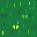
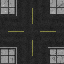
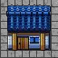
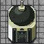
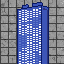

# TramBuilder

**Simple Python Tram Builder Game**


## Overview

- [Lines](#lines)

- [Stations](#stations)

- [Modes](#modes)

- [Camera](#camera)

- [Tile Types](#tile-types)

- [Population and Quality Factor](#population-and-quality-factor)

- [Money](#money)

- [World Generation](#world-generation)

- [Resource Sources](#resource-sources)

- [Known Issues](#known-issues)

## Lines

- Add a new line by clicking the button labeled "+" in the top left
- Remove a line by right clicking its icon in the top left
- In Build Mode, select a line in the top left and click anywhere to build, however there are some restrictions:
- - The line needs a connecting part
- - The player must have sufficient money
- - There may be no triple intersections (**However lines of the same color may go next to each other**)
- - Loops are allowed (**creating a loop will disable you from continuing to build the line!!!**)
- - Lines can only be build on street or park tiles
- - Lines must follow the streets (except when entering or exiting a park)
- - There can be maximum 5 lines on one tile and maximum 10 in total
- You can also switch between lines using the **Arrow Keys**


## Stations

- Add a new station by right clicking while in build mode
- Stations can not be removed
- Left click a station in select mode to see its name at the top
- Building a station also has restrictions:
- - A station can only be built on top of a line
- - The player must have sufficient money

## Modes

- There are two modes:
- - Build Mode
- - Select Mode
- In Build Mode, you can build lines and stations
- In Select Mode, you can select a station to view its name at the top
- The Mode can be switched by pressing the button in the top right, which shows the current mode, or by pressing **B**

## Camera

- You can look around by holding the middle mouse button down and moving the mouse
- You can zoom by using the scroll wheel
- You can reset zoom and position by pressing **Backspace**

## Tile Types

- There are 5 types of tiles:

<table>
  <tr>
    <td align="center">
      <br>
      Park Tiles
    </td>
    <td align="center">
      <br>
      Street Tiles
    </td>
    <td align="center">
      <br>
      Settlement Tiles
    </td>
    <td align="center">
      <br>
      Industry Tiles
    </td>
    <td align="center">
      <br>
      Skyscraper Tiles
    </td>
  </tr>
</table>

- Each Tile has a different population and quality factor

## Population and Quality Factor

---

- Each Tile has a Quality Factor and a Population dependent on its type:

| Tile type   | Population | Quality factor |
|-------------|------------|----------------|
| Park        | 20 - 60    | 1.02           |
| Street      | 40 - 120   | 1.00           |
| Settlement  | 120 - 360  | 0.998          |
| Industry    | 230 - 690  | 0.985          |
| Skyscraper  | 450 - 1350 | 0.996          |


## Money

- Money is earned every second per station per line
- Money is not earned while a popup is open
- The money is determined by 
- - The amount of stations on the line
- - The Population around each station
- - The Quality Factor around each station
- - The Radius of each station is 3 tiles in each direction
- As a result having stations around highly populated or high quality areas increases revenue
- Having lines with many stations or stations with many lines increases revenue
- The prices also increase with the money you earn. Base prices are:
- - Line: 30
- - Station: 60
- - Start Money: 1000
- Deleting a line will give you back the money as if it would have been bought for the base price of 30

## World Generation

- The world gets generated in 6 steps:
1. Generate streets from the middle outwards
2. Generate 4 park areas
3. Generate 2 industry areas
4. Generate 6 skyscrapers
5. Fill remaining tiles with settlements
6. Give each tile a population within its range

- The world generation can result in some tiles being out of range of stations, making the game harder or less fun
- Because of this, it is possibly to start the game with the flag --seed

```
python3 main.py --seed <seed>
```
- Here are some example seeds I found to work well:


| Seed     |
|----------|
| 3909300  |
| 6181335  |
| 8690652  |
| 7892260  |

## Resource Sources

| Resource                      | Source                                                                          |
|-------------------------------|---------------------------------------------------------------------------------|
| Park Tiles                    | https://pigeonhat.itch.io/park-tileset#google_vignette                          |
| Street Tiles                  | https://opengameart.org/content/road-tile-textures                              |
| Settlement and Industry Tiles | https://gamesprites.fandom.com/wiki/Pokemon_homes                               |
| Skyscraper Tiles              | https://oldninjacat.itch.io/skyscraper-buildings-asset?download#google_vignette |

Some Tiles have been modified or put together to create new ones.


## Known Issues

- Sometimes placing a station on the topmost y point will not work (might be fixed?)
- When putting the game in fullscreen and hovering out of the world area the game will crash (As far as I am aware its not possible to fullscreen the game on Windows, so there is no need to fix it)
- Window size might be too small on 1440p or 4k monitors, so increasing display scale is recommended
